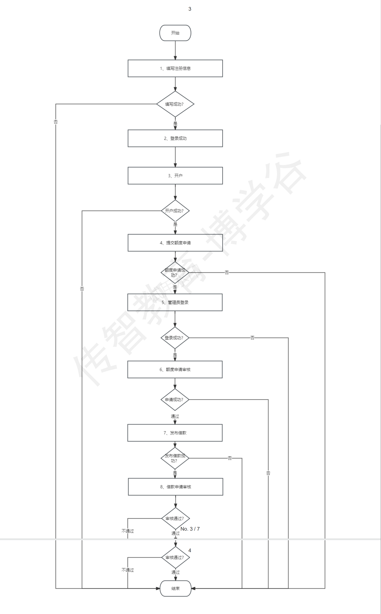

# chuanbozhike-shop
金融借贷项目
# 商城项目手工测试记录

## 📋 项目介绍
这是一个[商城名称]的手工测试项目，主要覆盖该商城的前台用户功能、后台管理功能的测试验证。

## 借款流程
1. 注册登录 开通资金托管
2. 前台申请额度 后台额度管理的额度列表进行审核通过
3. 前台个人主页-点击品质理财-个人借款-信用标（立即借款）
4. 后台初审管理-初审标（审核通过）
5. 前台智能投顾-投资列表（投标）

## 业务流程测试步骤
1. 注册并登录（判定）
2. 开户成功
  - 填写开户信息
  - 调用第三方开户系统
3. 额度申请
  - 提交额度申请
  - 管理员后台登录
  - 管理员进行审核通过
4. 发布借款成功
  - 提交借款申请
  - 管理员后台登录
  - 管理员审核借款申请
5. 借款流程图
    
## 投资人
1. 注册投资人账号，并自动登录（账号：13726312257）
2. 开户-投资列表-投标
3. 风险评测判断
4. 第二次投标，判定账户余额是否充足（可充值）
5. 投资
6. 管理员登录
7. 管理员满标待审（通过）
8. 投资流程图
   

## 项目地址
- **前台地址**：（账号：13726312227，密码256244ljb，验证码666666）
- **后台地址**：（账号/密码：admin，HM_2025_test，验证码8888）
- **前台地址**：[点击访问前台](http://121.43.169.97:8081/)
- **后台地址**：[点击访问后台](http://121.43.169.97:8082/)

## 测试范围
### 1. 前台功能测试
- 用户注册/登录
- 商品浏览/搜索/筛选
- 购物车操作
- 订单提交/支付流程
- 个人中心（订单查询、地址管理等）

### 2. 后台功能测试
- 商品管理（新增/编辑/上下架）
- 订单管理（处理/发货/退款）
- 用户管理（查看/权限配置）
- 数据统计（销量/订单报表）

## 测试资源
- 测试用例文档：[点击查看测试用例.xlsx](测试用例文件的链接，上传后替换)
- Bug记录：[点击查看Bug清单.md](Bug文件的链接，上传后替换)
- 测试截图：[截图文件夹](截图文件夹的链接，若上传了截图文件夹)

## 📌 测试总结
- 已覆盖的功能：xxx
- 未完成的测试：xxx
- 重点注意项：xxx
